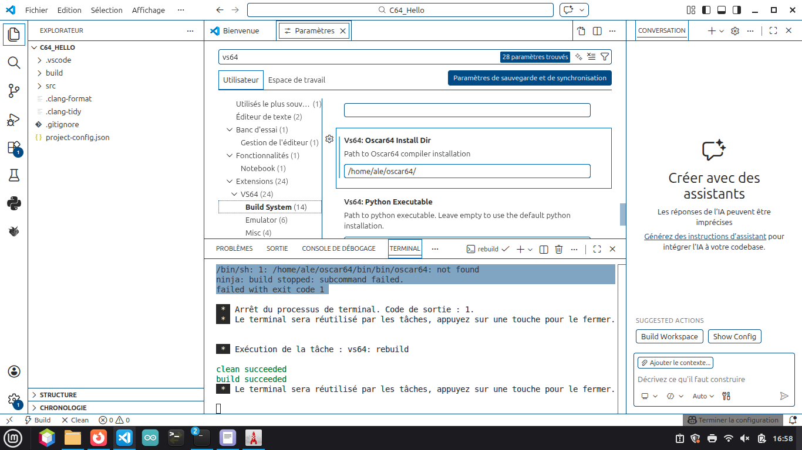
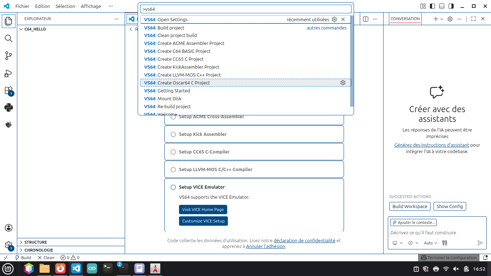
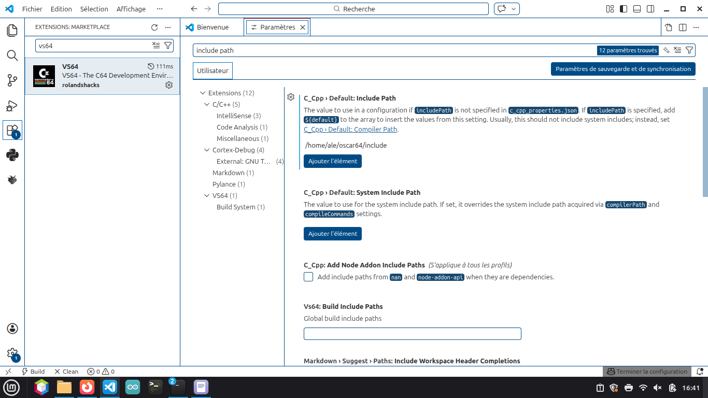
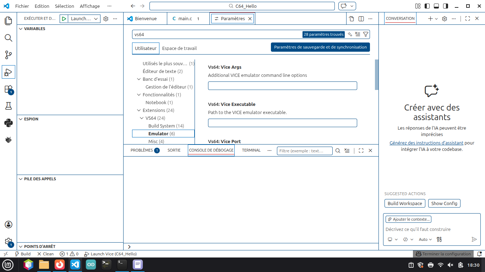
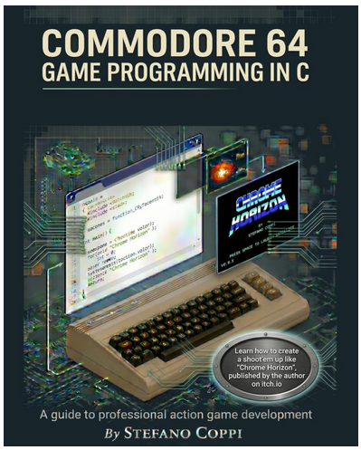

# Installation de VICE et des ROMs Commodore 64

## Installation de VICE

Installer l'émulateur VICE depuis les dépôts Ubuntu/Debian :

```bash
sudo apt install vice
```

Site officiel de VICE :

https://vice-emu.sourceforge.io/index.html#download

## Copie des ROMs

Selon les distributions, les ROMs Commodore 64 peuvent ne pas être fournies avec le paquet `vice`.

Copier les ROMs depuis le dépôt local `commodore64` vers le répertoire de VICE :

```bash
cd /usr/share/vice/C64
cp ~/commodore64/rom/*.bin .
```

Exemple :

```bash
ale@ale-desktop:/usr/share/vice/C64$ cp ~/commodore64/rom/*.bin .
```

## Vérification

Lister les fichiers présents :

```bash
ls -l /usr/share/vice/C64
```

Les fichiers ROM (`*.bin`) doivent apparaître dans ce répertoire avant de lancer l'émulateur.


# Installation d'Oscar64 (Linux Mint / Ubuntu)

Oscar64 est un compilateur C moderne pour Commodore 64.

> Il est recommandé d'installer les sources dans votre répertoire personnel (`~/oscar64`).

## 1. Installer les outils de compilation

```bash
sudo apt update
sudo apt install git build-essential cmake
```

## 2. Récupérer les sources

```bash
cd ~
git clone https://github.com/drmortalwombat/oscar64.git
cd oscar64
```

Exemple de sortie :

```text
ale@ale-desktop:~$ git clone https://github.com/drmortalwombat/oscar64.git
Clonage dans 'oscar64'...
remote: Enumerating objects: 13944, done.
remote: Counting objects: 100% (288/288), done.
remote: Compressing objects: 100% (128/128), done.
remote: Total 13944 (delta 243), reused 177 (delta 160), pack-reused 13656 (from 4)
Réception d'objets: 100% (13944/13944), 12.86 Mio | 4.19 Mio/s, fait.
Résolution des deltas: 100% (10804/10804), fait.

ale@ale-desktop:~$ cd oscar64/
```

## 3. Compiler Oscar64

Depuis le répertoire des sources :

```bash
make -C make all
```

La compilation peut prendre quelques minutes selon la machine.

## 4. Vérifier l'exécutable

Rechercher le binaire généré :

```bash
find . -type f -name oscar64
```

Tester ensuite l'exécutable :

```bash
./oscar64
```

ou selon son emplacement :

```bash
./bin/oscar64
```

---

# Oscar64 — Guide rapide

## Utilisation générale

```bash
oscar64 [options] source.c
```

---

## Générer un programme (.prg)

```bash
oscar64 main.c -o=main.prg
```

Option :

```text
-o=output.prg
```

---

## Optimisation

```text
-O0   sans optimisation
-O1
-O2   recommandé
-O3   agressif
```

Exemple :

```bash
oscar64 main.c -O2
```

---

## Exécution dans l'émulateur intégré

```bash
oscar64 main.c -O2 -e
```

Option :

```text
-e
```

---

## Debug

```text
-g
```

---

## Mode simplifié

```text
-n
```

---

## Générer une image disquette (.d64)

```bash
oscar64 main.c -O2 -d64=game.d64
```

Option :

```text
-d64=nom.d64
```

---

## Définir des macros

```bash
oscar64 main.c -dDEBUG
```

Options :

```text
-dSYMBOL
-dSYMBOL=1
```

---

## Ajouter des répertoires d'inclusion

```bash
oscar64 main.c -i=include
```

Option :

```text
-i=chemin_include
```

---

## Ajouter des fichiers supplémentaires

```bash
oscar64 main.c -f sprite.c
```

Option :

```text
-f fichier
```

---

# Exemples utiles

Compilation simple :

```bash
oscar64 main.c -O2 -o=main.prg
```

Test direct dans l'émulateur :

```bash
oscar64 main.c -O2 -e
```

Créer une image disquette :

```bash
oscar64 main.c -O2 -d64=demo.d64
```

---

# Workflow C64 recommandé

```text
Pixel Art (LibreSprite / Aseprite)
            ↓
Compilation (Oscar64)
            ↓
Test (VICE)
```

---

# Résumé rapide

```text
-o      génère un fichier .prg
-O2     optimisation standard
-e      exécution immédiate
-g      debug
-d64    génère une image disquette
```
---
## Installation et configuration ds vscode





## Ajout de la bibliothéque



## Comfiguration de l'émulateur (ne rien mettre pour Linux)




---

# Alternative sous Windows : C64Studio

Si vous développez sur Windows, il existe également **C64Studio**, un environnement de développement complet dédié au Commodore 64 créé par Georg Rottensteiner. Il est disponible gratuitement et en open source. C64Studio est une IDE .NET conçue pour le développement C64 en assembleur et BASIC, avec intégration de l'émulateur VICE pour le débogage.

GitHub :

https://github.com/GeorgRottensteiner/C64Studio

Site officiel :

https://www.georg-rottensteiner.de/en/c64.html

## Fonctionnalités principales

* Éditeur de code avec gestion de projets
* Assembleur intégré compatible ACME
* Support BASIC V2
* Intégration de VICE pour le debug
* Éditeur de sprites
* Éditeur de caractères (charset)
* Éditeur d'écrans texte et bitmap
* Gestion des images disquettes (.d64)
* Génération de fichiers `.prg`, `.d64`, `.t64`, `.crt` et `.bin`

## Installation

Télécharger la dernière version depuis :

https://github.com/GeorgRottensteiner/C64Studio/releases

ou depuis le site officiel :

https://www.georg-rottensteiner.de/en/c64.html

Une fois installé, il suffit de configurer le chemin vers VICE dans les paramètres pour pouvoir compiler, lancer et déboguer directement vos programmes Commodore 64 depuis l'IDE.

## Oscar64 ou C64Studio ?

### Oscar64 (Linux)

* Compilateur C moderne pour C64
* Utilisable en ligne de commande
* Très adapté aux projets écrits en C
* Fonctionne parfaitement sous Linux Mint et Ubuntu

### C64Studio (Windows)

* IDE graphique complète
* Très adaptée à l'assembleur 6502 et au BASIC
* Outils graphiques intégrés (sprites, charset, écrans)
* Débogage intégré avec VICE

Les deux outils peuvent être utilisés ensemble : Oscar64 pour la compilation C et C64Studio pour l'édition de ressources graphiques ou le développement assembleur.

---

# Éditeurs de sprites et graphismes Commodore 64

Pour développer des jeux ou des démos sur Commodore 64, plusieurs outils permettent de créer des sprites, des tiles, des caractères (charset), des cartes (maps) et des graphismes pixel art.

## SpritePad

SpritePad est l'un des éditeurs de sprites C64 les plus connus. Il permet de créer et modifier des sprites matériels Commodore 64, aussi bien en mode monochrome qu'en multicolore. Il est très utilisé dans le développement de jeux C64 depuis de nombreuses années.

Téléchargement :

https://csdb.dk/release/?id=132081

Utilisation typique :

* Création de sprites C64
* Animation de sprites
* Export des données pour l'assembleur ou le C

---

## CharPad C64 (version gratuite)

CharPad est un éditeur spécialisé dans les caractères (charset), les tiles et les cartes de niveaux. Il permet de produire des données graphiques compatibles Commodore 64 et de construire des maps complètes pour les jeux.

Téléchargement :

https://subchristsoftware.itch.io/charpad-c64-free

Fonctionnalités :

* Éditeur de caractères (charset)
* Éditeur de tiles
* Éditeur de cartes (maps)
* Import d'images bitmap
* Export des données binaires pour les projets C64

---

## Multipaint

Multipaint est un éditeur graphique multiplateforme orienté rétro-computing. Il supporte de nombreuses machines 8 bits et 16 bits, dont le Commodore 64.

Le programme est écrit en Java (Processing) et fonctionne sous Linux, Windows et macOS.

Site officiel :

http://multipaint.kameli.net/

Fonctionnalités :

* Pixel art rétro
* Support des palettes C64
* Import et export vers plusieurs formats rétro
* Travail sur sprites et écrans complets

---

## LibreSprite

LibreSprite est un éditeur de pixel art et d'animation libre et open source. Il est dérivé d'une ancienne version open source d'Aseprite et permet la création de sprites animés avec gestion des calques et des frames.

Site officiel :

https://libresprite.github.io/#!/

Fonctionnalités :

* Pixel art
* Animation image par image
* Gestion des calques
* Gestion des palettes
* Export PNG et spritesheets
* Disponible sous Linux, Windows et macOS

LibreSprite est particulièrement pratique sous Linux Mint et Ubuntu pour préparer les graphismes avant leur conversion vers les formats Commodore 64.

---

# Workflow graphique recommandé

```text
LibreSprite / SpritePad
           ↓
      Export sprites
           ↓
      CharPad (tiles/maps)
           ↓
      Oscar64
           ↓
         VICE
```

## Quel outil choisir ?

### Pour les sprites C64

* SpritePad

### Pour les tiles et les cartes

* CharPad

### Pour le pixel art moderne multiplateforme

* LibreSprite

### Pour les écrans complets et le rétro multi-machines

* Multipaint

Ces outils sont complémentaires et sont souvent utilisés ensemble dans les projets Commodore 64 modernes.


---

# À propos de ce dépôt

Ce dépôt est fortement inspiré des travaux de Stefano Coppi autour du développement moderne sur Commodore 64 en langage C avec le compilateur Oscar64.

L'objectif est de proposer un environnement simple permettant de retrouver rapidement tous les outils nécessaires au développement C64 sous Linux :

* VICE
* Oscar64
* SpritePad
* CharPad
* Multipaint
* LibreSprite
* Documentation et exemples

## Source d'inspiration

Stefano Coppi a publié le projet **Chrome Horizon**, un shoot'em up Commodore 64 développé entièrement en langage C avec Oscar64 afin de démontrer qu'il est possible d'obtenir des performances de niveau commercial sans écrire l'intégralité du code en assembleur.

Le code source est disponible sur GitHub :

```bash
git clone https://github.com/stefanocoppi/chrome-horizon-C64
```

Chrome Horizon sert également de base à son livre consacré au développement de jeux d'action professionnels sur Commodore 64 en utilisant un workflow moderne et le compilateur Oscar64.

Parmi les techniques abordées :

* Programmation en C pour Commodore 64
* Gestion mémoire
* Raster IRQ
* Multiplexage de sprites
* Scrolling fluide
* Optimisations spécifiques au VIC-II
* Organisation d'un projet de jeu complet

## Philosophie du projet

Pendant longtemps, le développement C64 performant a été considéré comme réservé à l'assembleur 6502.

Les projets comme Chrome Horizon montrent qu'il est aujourd'hui possible d'utiliser :

```text
Code C moderne
       +
Oscar64
       +
Outils graphiques modernes
       +
VICE
       =
Développement C64 efficace
```

tout en conservant des performances compatibles avec les contraintes matérielles du Commodore 64.

## Objectif de ce dépôt

Ce dépôt n'est pas une copie du travail de Stefano Coppi.

Le livre de Stefano Coppi est disponible sur Amazon :

[Game Development on the Commodore 64 with Oscar64](https://www.amazon.fr/dp/B0H1M9C61F)



Il s'agit d'un environnement de travail personnel regroupant :

* les ROMs nécessaires à VICE ;
* les outils de développement ;
* la documentation d'installation ;
* des exemples et expérimentations autour du développement Commodore 64 en C.

L'objectif est de disposer rapidement d'une station de développement C64 complète sous Linux Mint ou Ubuntu.


